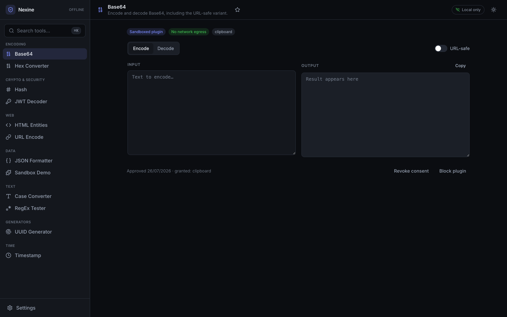
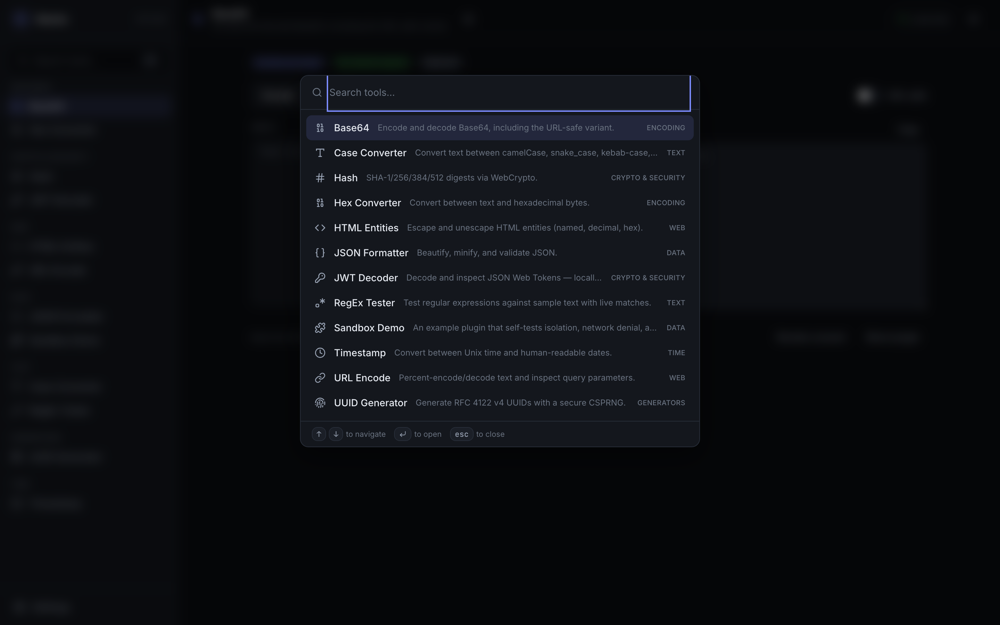
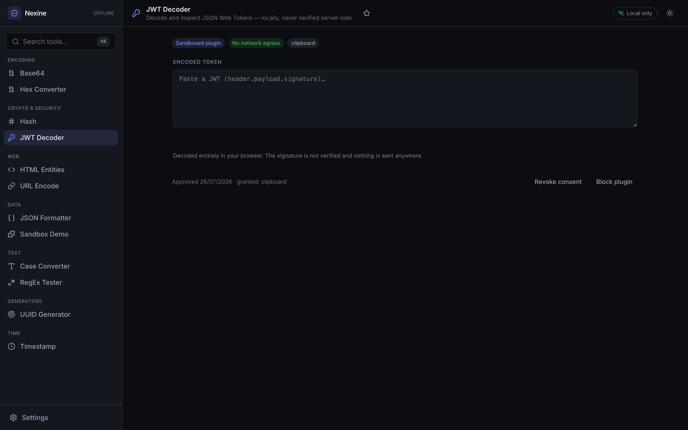
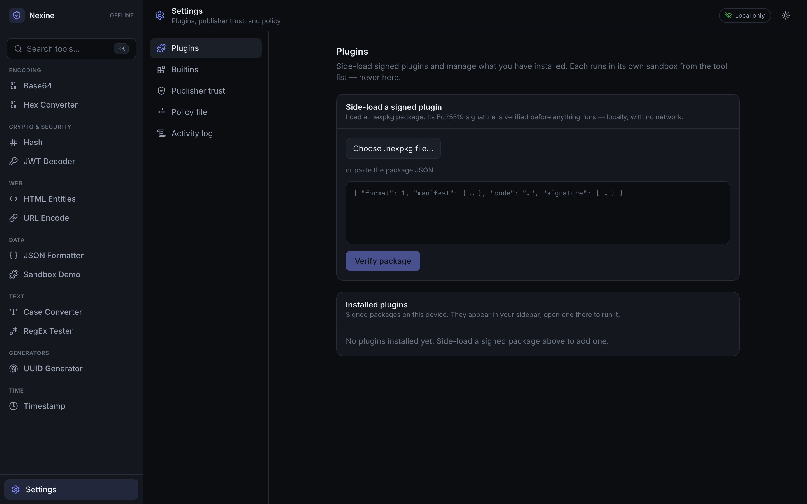
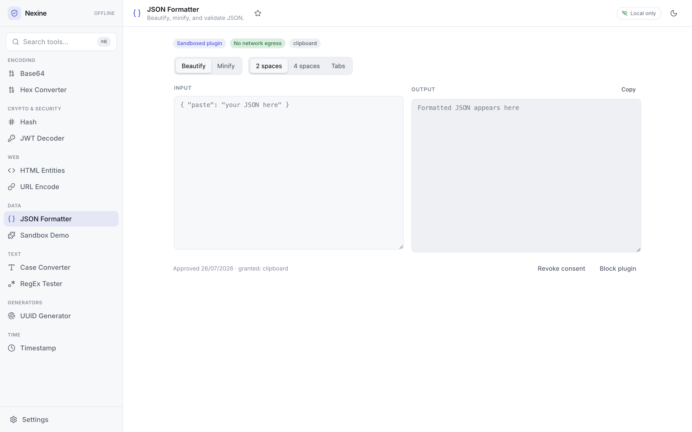

# Nexine

**An offline-first, no-egress developer toolbox that grows into a governed plugin platform.**
Your data never leaves your machine.

<!-- prettier-ignore-start -->
[](https://github.com/nanduajith/nexine/actions/workflows/ci.yml)
[](https://github.com/nanduajith/nexine/actions/workflows/release.yml)
[](https://github.com/nanduajith/nexine/actions/workflows/ci.yml)
[](docs/security-model.md)
[](#desktop-app-tauri)
[](LICENSE)
[](https://nanduajith.github.io/nexine/)
<!-- prettier-ignore-end -->

📖 **Full documentation & live walkthrough:** **[nanduajith.github.io/nexine](https://nanduajith.github.io/nexine/)**

Nexine is a cross-platform (desktop + self-hostable web) collection of everyday developer
utilities — JWT, Base64, URL, hashing, JSON, and more — built so a security-conscious enterprise
can offer a sanctioned alternative to pasting production secrets into random online tools. Under
the hood, **every tool is a sandboxed plugin**, and third parties can build, sign, and side-load
their own — all without ever giving the app the ability to phone home.

> _Nexine_ — after the **nexine**, the inner protective layer of a pollen-grain wall: a hardened
> shell that keeps what's inside safe.

---

## The guarantee: no egress

Everything runs **100% client-side**. The production build ships a strict Content-Security-Policy
with `connect-src 'none'` — the application literally **cannot open a network connection**.
`fetch`, `XMLHttpRequest`, `WebSocket`, `EventSource`, and `sendBeacon` are all blocked by the
browser. Fonts are self-hosted (no CDN), there is no account, and there is no telemetry. This is
verified by an automated test (`connect-src 'none'` present, `unsafe-eval` never present).

**The technical moat:** unlike VS Code extensions (which share a Node process with unrestricted
fs/network), a Nexine plugin gets **deterministic, host-enforced network denial**. Its iframe
ships `connect-src 'none'` unless an admin grants a scoped, _declared_ network permission — and
even then the host is never a proxy, so the app-wide no-egress guarantee can't leak.

Egress is therefore a **governed, opt-in capability, not a limitation**: an org can set network
to _deny-by-default_ and then allow exact hosts globally or per plugin (**Settings → Egress
control**, or a distributed policy file). See [`docs/governance.md`](docs/governance.md#controlling-egress).

See [`docs/security-model.md`](docs/security-model.md) for exactly how this is enforced and its
honest non-goals.

---

## Screenshots

|                                                                                                                                            |                                                                                          |
| ------------------------------------------------------------------------------------------------------------------------------------------ | ---------------------------------------------------------------------------------------- |
|                                                                |                 |
| **Every tool runs in an opaque-origin sandbox** — note the `Sandboxed plugin` / `No network egress` badges and the per-plugin consent bar. | **⌘K command palette** — fuzzy-find and jump to any tool.                                |
|                                                                                     |             |
| **JWT decoder** — decoded entirely locally; sensitive input is never persisted.                                                            | **Settings** — side-load signed plugins, pin publishers, set policy, read the audit log. |

<p align="center">
  
  <br><em>First-class light theme.</em>
</p>

---

## Tools

Twelve tools ship built-in — each a sandboxed plugin, enabled by default and removable:

| Tool           | What it does                                           |
| -------------- | ------------------------------------------------------ |
| JWT Decoder    | Decode & inspect JWTs locally (sensitive — no history) |
| Base64         | Encode/decode, Unicode-safe, URL-safe variant          |
| Hex Converter  | Text ↔ hexadecimal bytes                               |
| URL Encode     | Percent-encode/decode + query-string inspection        |
| HTML Entities  | Escape/unescape named, decimal, and hex entities       |
| Hash           | SHA-1/256/384/512 via WebCrypto                        |
| JSON Formatter | Beautify, minify, validate                             |
| RegEx Tester   | Test patterns with live match highlighting             |
| UUID Generator | RFC 4122 v4 UUIDs via a secure CSPRNG                  |
| Timestamp      | Unix ↔ ISO/UTC/local date conversion                   |
| Case Converter | camelCase / snake_case / kebab-case and more           |
| Sandbox Demo   | A self-test that proves the sandbox isolation          |

Plus a **⌘K command palette**, starrable favorites, dark/light themes, and — on desktop — a
global summon hotkey.

---

## The plugin platform

Nexine has **one execution path** for tools: an opaque-origin, CSP-locked iframe with
host-brokered RPC. There is no privileged in-process path — the builtins above run in the exact
same sandbox as an untrusted, side-loaded plugin. The only difference is where the source comes
from (bundled in the app vs. a signed package on disk).

- **Public SDK** ([`@nexine/sdk`](packages/sdk)) — a stable, serializable manifest; a small,
  audited permission vocabulary (`network` with a host allowlist, `clipboard`, `storage`);
  plain-language `dataFlows` egress declarations; and a UI-framework-agnostic guest API
  (`definePlugin` → `mount(root)`).
- **Sandbox runtime** ([`@nexine/plugin-runtime`](packages/plugin-runtime)) — validates the
  manifest _before any code runs_, resolves permissions against policy, computes a **per-plugin
  CSP**, creates the `sandbox="allow-scripts"` iframe, and brokers storage/clipboard over a
  private `MessageChannel`. Deny-by-default: an ungranted capability is unreachable.
- **Signed packages** ([`@nexine/packaging`](packages/packaging) + [`@nexine/cli`](packages/cli)) —
  a `.nexpkg` is a manifest + a bundled classic-script module + a detached **Ed25519** signature.
  The `nexine` CLI does `keygen / pack / verify / inspect`, entirely locally.
- **DIY governance** — install-time consent (per plugin _and_ version), publisher trust, graduated
  policy modes (`allow → blocklist → lockdown`), **egress control** (deny-by-default network with
  global and per-plugin host allow-lists), a shareable **policy file**, and a metadata-only
  **audit log**. All on-device; no account.

Build one in [`docs/plugins.md`](docs/plugins.md); a working reference lives in
[`examples/cron-explainer`](examples/cron-explainer).

```bash
pnpm build:cli                                       # build the `nexine` binary
pnpm nexine keygen --label "My Plugins"              # Ed25519 keypair (keep *.key.json secret)
pnpm nexine pack examples/cron-explainer --key nexine.key.json
pnpm nexine verify dev.nexine.cron-explainer-1.0.0.nexpkg --trust nexine.pub.json
```

Then **Settings → Plugins → Choose `.nexpkg` file** to side-load it. It appears in the sidebar
under its category, alongside the builtins.

---

## Architecture

A **pnpm workspace monorepo** with strict, one-directional dependencies (everything points up
toward the framework-free `core`; ESLint forbids React in `core`).

| Package                                              | Role                                                                                                |
| ---------------------------------------------------- | --------------------------------------------------------------------------------------------------- |
| [`packages/core`](packages/core)                     | Framework-free domain: `ToolMeta`, registry, search, and the CSP builder. No React, ever.           |
| [`packages/sdk`](packages/sdk)                       | The public plugin contract: manifest, permissions, data-flows, validation, RPC protocol, guest API. |
| [`packages/ui`](packages/ui)                         | The React design system: tokens, primitives, and the `ToolModule` contract.                         |
| [`packages/plugin-runtime`](packages/plugin-runtime) | The sandbox: permission engine, per-plugin CSP, RPC host, `loadPlugin` / `loadPackage`.             |
| [`packages/packaging`](packages/packaging)           | Signed `.nexpkg` format: canonical JSON, Ed25519 (WebCrypto), `TrustStore`.                         |
| [`packages/cli`](packages/cli)                       | The `nexine` binary — `keygen / pack / verify / inspect`.                                           |
| [`packages/host`](packages/host)                     | **The app**: shell, routing, storage, the sandbox host, builtins, and the governance UI.            |
| [`tools/*`](tools)                                   | One package per tool — a pure, unit-tested `transform`, reused by the builtins.                     |
| [`examples/*`](examples)                             | Sample plugins you can pack, sign, and side-load.                                                   |

Full detail — the dependency graph, the "everything is a sandboxed plugin" model, and where
state is persisted — is in [`docs/architecture.md`](docs/architecture.md).

---

## Development

Requires **Node ≥ 20** and **pnpm** (`packageManager: pnpm@11`).

```bash
pnpm install       # install workspace dependencies
pnpm dev           # start the dev server (http://localhost:5273)
pnpm test          # run unit tests (transforms, CSP, signing round-trip, permission engine)
pnpm typecheck     # type-check the monorepo
pnpm lint          # lint (also enforces import boundaries)
pnpm build         # production build (strict no-egress CSP)
pnpm build:cli     # build the `nexine` CLI binary (dist/bin.js)
```

---

## Desktop app (Tauri)

The same frontend ships as a native desktop app via [Tauri](https://tauri.app) (`src-tauri/`),
adding a global summon hotkey (⌘/Ctrl+Shift+Space) and OS-keychain-backed secret storage.
Building it requires the Rust toolchain, and icons must be generated once
(`pnpm tauri icon <image>`).

```bash
pnpm desktop:dev      # run the desktop app in development
pnpm desktop:build    # produce a native installer
```

> The desktop packaging follows the standard Tauri v2 layout but is not compiled in CI (no Rust
> toolchain there yet); build it on a machine with Rust installed.

---

## Self-hosting

Nexine is static and backend-free. Build a Docker image or serve `packages/host/dist` from any
static host — including air-gapped networks. See [`docs/self-hosting.md`](docs/self-hosting.md).

```bash
docker build -f deploy/Dockerfile -t nexine .
docker run --rm -p 8080:80 nexine        # http://localhost:8080
```

The provided [`deploy/nginx.conf`](deploy/nginx.conf) also sends the no-egress CSP as a real
HTTP header (defense in depth), plus `X-Content-Type-Options`, `Referrer-Policy`, and a
restrictive `Permissions-Policy`.

---

## Documentation

| Doc                                              | Covers                                                                      |
| ------------------------------------------------ | --------------------------------------------------------------------------- |
| [docs/architecture.md](docs/architecture.md)     | Monorepo layout, package graph, the sandboxed-plugin model, persistence.    |
| [docs/security-model.md](docs/security-model.md) | The no-egress guarantee, the sandbox, signed side-loading, non-goals.       |
| [docs/plugins.md](docs/plugins.md)               | Authoring, packaging, signing, and side-loading a plugin.                   |
| [docs/governance.md](docs/governance.md)         | Consent, publisher trust, policy modes, the policy file, and the audit log. |
| [docs/self-hosting.md](docs/self-hosting.md)     | Docker and static-host deployment, including air-gapped.                    |

---

## Roadmap

- **Phase 1 — MVP toolbox** ✅ shipped: the offline tools, no-egress CSP, palette, favorites,
  themes, desktop + self-host.
- **Phase 2 — Plugin platform (OSS)** ✅ functionally complete: SDK, iframe sandbox + permission
  engine, per-plugin CSP, signed side-load, the `nexine` CLI, and the local/DIY governance tier
  (consent, trust, policy modes, policy file, audit log).
- **Phase 3 — Ecosystem + Enterprise** ⏳ planned: community open registry → hosted marketplace →
  enterprise control plane (SSO, fleet policy distribution + drift detection, SIEM audit
  aggregation, supported air-gapped binary).

The full product plan — strategy, open-core boundary, and stage gates — is in
[`product-plan.md`](product-plan.md).

---

## License

[MIT](LICENSE). Open-core: the client, tools, sandbox, permission enforcement, and DIY local
governance are free and open source. (The hosted marketplace and enterprise control plane in
Phase 3 are the commercial line.)
